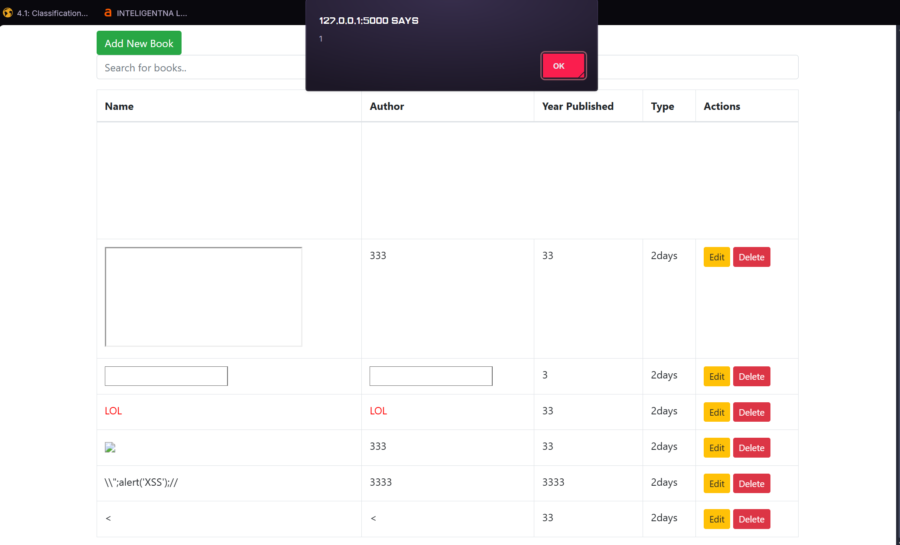
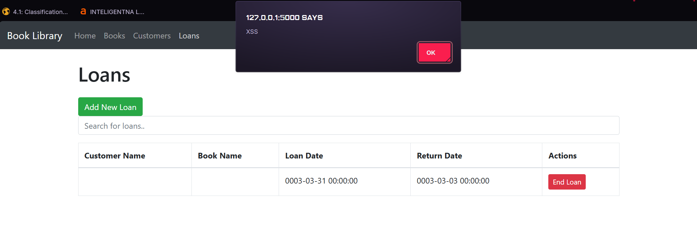

**Przykłady wystąpień podatności XSS:**

**Przykłady wstrzyknięć:**
- <BODY ONLOAD=alert(’XSS’)>
- 
- 
LOL
- <svg><script ?>alert(1)
- I kilka innych, niektóre tworzą iframe'y, których trudno się pozbyć, w tym wypadku administrator musi usunąć rekord z bazy danych aplikacji.

Sposób rozwiązania podatności dla aplikacji do wypożyczania książek:
- Sprawdzenie długości ciągu znakowego dla pól formularza.
- Wykorzystanie zapytania Regex, w celu eliminacji znaków specjalnych pozwalających na wykonanie kodu HTML'owego.
- Wykorzystanie funkcji, które potraktują kod jako tekst.
